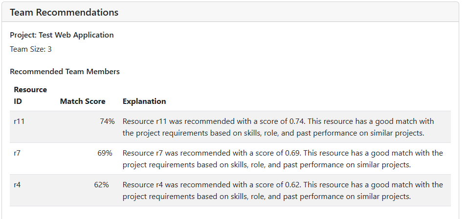
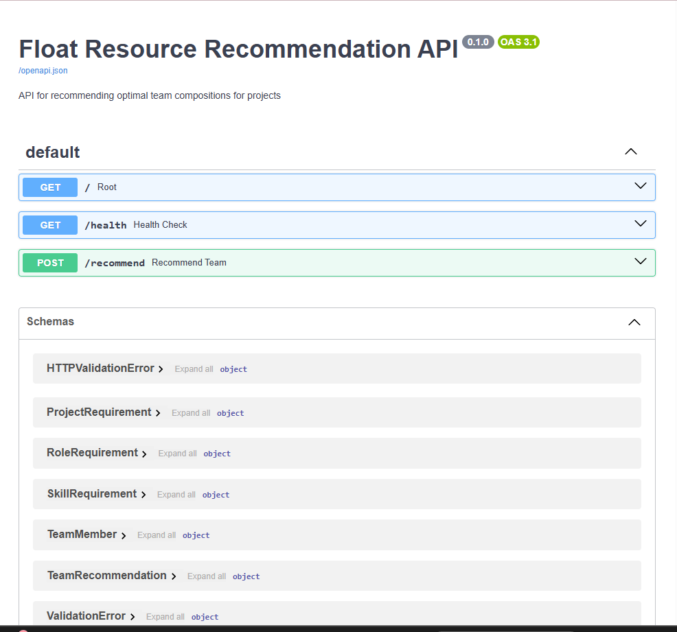
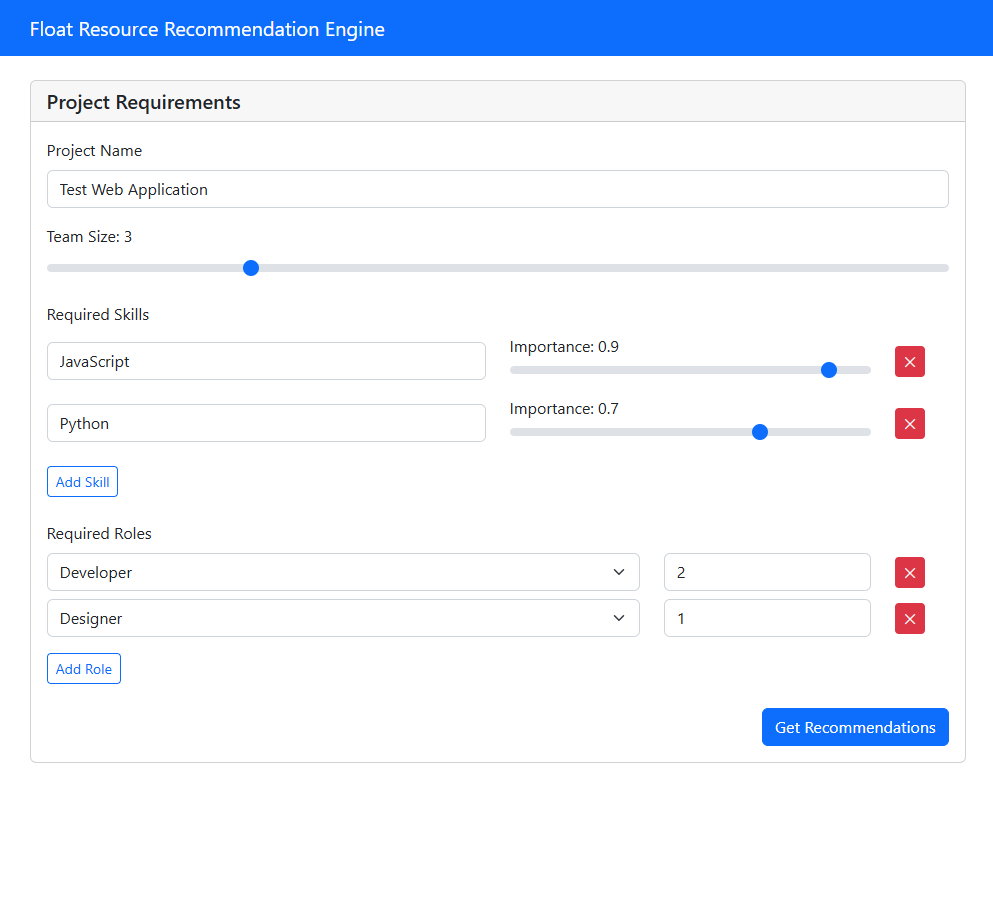

# AI Resource Recommendation Engine

## Project Overview
This project demonstrates an AI-powered resource recommendation system for Float, designed to help professional services teams make smarter resourcing decisions by learning from past project success patterns.
The Resource Recommendation Engine helps professional service teams make smarter resourcing decisions by learning from historical project data and recommending ideal team compositions for new projects. This aligns with Float's mission to provide intelligent resource management for professional services teams.




## Problem Statement
Professional services teams struggle with optimal resource allocation. This system analyzes historical project data to identify patterns in successful teams and recommends optimal team compositions for new projects.

### Features

- **Pattern Detection**: Identifies successful team composition patterns from historical data
- **Skill-Based Matching**: Recommends resources based on required skills and proficiency
- **Role Optimization**: Ensures proper distribution of roles in recommended teams
- **Constraint Handling**: Applies business constraints such as team size and budget
- **Interactive Interface**: User-friendly frontend for submitting requirements and viewing recommendations

## Architecture

The system is built with a modular architecture that allows for easy extension and maintenance:

1. **Data Processing Pipeline**: Transforms raw project and resource data into features for machine learning
2. **Recommendation Models**: 
   - Collaborative filtering for finding patterns in past project allocations
   - Content-based filtering for matching skills and roles
   - Constraint optimization for applying business rules
3. **REST API**: Exposes the recommendation engine through well-defined endpoints
4. **Frontend Interface**: Provides a user-friendly way to submit project requirements and view recommendations

## 🛠️ Technology Stack

- **Backend**: Python, FastAPI, scikit-learn, PuLP (constraint optimization)
- **Frontend**: HTML5, CSS3, JavaScript (Vanilla)
- **Data Processing**: Pandas, NumPy
- **Visualization**: Matplotlib, Seaborn
- **API Documentation**: Swagger/OpenAP

## Technical Details

### Data Processing

The data pipeline handles:
- Cleaning and preprocessing of raw data
- Feature engineering for model inputs
- Train/test splitting for model evaluation

### Machine Learning Approach

The recommendation system uses a hybrid approach combining:

1. **Collaborative Filtering**:
   - Builds a resource-project matrix to identify patterns
   - Finds projects with similar resource allocations
   - Recommends resources that worked on similar projects

2. **Content-Based Filtering**:
   - Matches resources to projects based on skill requirements
   - Considers role requirements in team composition
   - Accounts for resource proficiency levels

3. **Constraint Optimization**:
   - Applies team size constraints
   - Ensures role requirements are met
   - Balances team composition

### API Design

REST API with the following endpoints:

- `GET /health`: API health check
- `POST /recommend`: Submit project requirements and get team recommendations

API documentation is available through Swagger UI at [http://localhost:8000/docs](http://localhost:8000/docs) when running the application.



### Frontend Interface

The frontend provides an intuitive interface for:
- Entering project details
- Specifying required skills with importance weights
- Defining role requirements
- Viewing recommended team compositions

### Project Requirements Form  


### Team Recommendations


## Getting Started

### Prerequisites

- Python 3.8+
- Required Python packages: `pandas`, `numpy`, `scikit-learn`, `matplotlib`, `seaborn`, `fastapi`, `uvicorn`, `pulp`

### Installation

1. Clone the repository:
   ```bash
   git clone https://github.com/yourusername/float-resource-recommendation-engine.git
   cd float-resource-recommendation-engine

2. Create a virtual environment:
   ```bash
   python -m venv venv
   source venv/bin/activate  # On Windows: venv\Scripts\activate

3. Install dependencies:
   ```bash
   pip install -r requirements.txt

### Model Training
1. Train the recommendation models:
   ```bash
   python scripts/train_model.py

### Running the Application
1. Start the API server:
   ```bash
   python scripts/run_api.py

2. Start the frontend server:
   ```bash
   cd frontend/float-dashboard
   python server.py

3. Open your browser to http://localhost:3000 to use the application.

### Usage Example

1. Open the frontend at http://localhost:3000
2. Fill out the project requirements:
  * Project name
  * Required skills with importance weights
  * Required roles and quantities
  * Team size

3. Click "Get Recommendations"
4. View the recommended team with match scores and explanations

### Technical Deep Dive
#### Data Processing Pipeline
The system processes synthetic data representing:

* Projects: Historical project data with success metrics
* Resources: Team members with skills, roles, and experience
* Allocations: Past resource-to-project assignments
* Feedback: Project outcomes and team performance

### Machine Learning Models
#### Collaborative Filtering

* Creates resource-project matrices to identify allocation patterns
* Finds projects with similar team compositions
* Recommends resources based on successful historical teams

#### Content-Based Filtering

* Matches resources to projects based on skill requirements
* Considers role compatibility and experience levels
* Weighs recommendations by skill importance and proficiency

#### Constraint Optimization

* Applies business rules (team size, role requirements)
* Uses linear programming to optimize team composition
* Ensures practical constraints are met while maximizing team quality

### Project Structure 
float-resource-recommendation-engine/
├── data/                      # Data storage
│   ├── raw/                   # Raw data
│   └── processed/             # Processed data
├── docs/                      # Documentation
│   └── images/                # Documentation images
├── frontend/                  # Frontend application
│   └── float-dashboard/       # Dashboard interface
├── models/                    # Saved model artifacts
├── notebooks/                 # Jupyter notebooks
│   ├── 01_data_exploration.ipynb      # Data analysis
│   ├── 02_model_development.ipynb     # Model development
│   └── 03_evaluation.ipynb            # Model evaluation
├── src/                       # Source code
│   ├── data/                  # Data processing modules
│   │   ├── data_generator.py  # Synthetic data generation
│   │   └── data_processor.py  # Data preprocessing
│   ├── models/                # ML model implementations
│   │   ├── collaborative_filtering.py  # Collaborative model
│   │   ├── content_based_filtering.py  # Content-based model
│   │   ├── constraint_optimizer.py     # Constraint optimizer
│   │   └── recommendation_model.py     # Combined engine
│   ├── api/                   # API implementation
│   │   └── main.py            # FastAPI application
│   ├── utils/                 # Utility functions
│   │   └── evaluation.py      # Model evaluation
│   └── visualization/         # Visualization tools
│       └── visualize.py       # Plotting functions
├── scripts/                   # Utility scripts
│   ├── generate_data.py       # Data generation script
│   ├── train_model.py         # Model training script
│   └── run_api.py             # API server script
├── requirements.txt           # Project dependencies
└── README.md                  # Project documentation

### Business Value
This system demonstrates capabilities that modern resource management platforms need:

* Improved Project Success: Data-driven team recommendations based on historical patterns
* Time Savings: Automated team composition reduces manual planning time
* Resource Optimization: Better utilization of team member skills and availability
* Scalability: API-based architecture enables integration with existing systems

### Future Enhancements

* Real-time Availability: Integration with calendar systems for availability tracking
* Success Prediction: ML models to predict project success probability
* Advanced Visualizations: Interactive dashboards for team composition analysis
* Feedback Loop: Learning from recommendation acceptance and project outcomes
* Multi-tenant Support: Support for multiple organizations with isolated data

### Development
#### Running Tests
`pytest tests/`

### API Testing
The API includes comprehensive documentation and testing interface at /docs when running locally.

### License
This project is for portfolio demonstration purposes.

### Contact
Iyanujesu Akinyefa

Email: [iyanujesuakinyefa@gmail.com]


